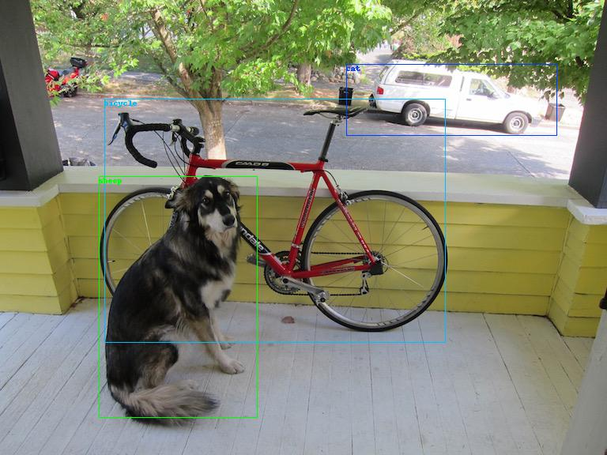
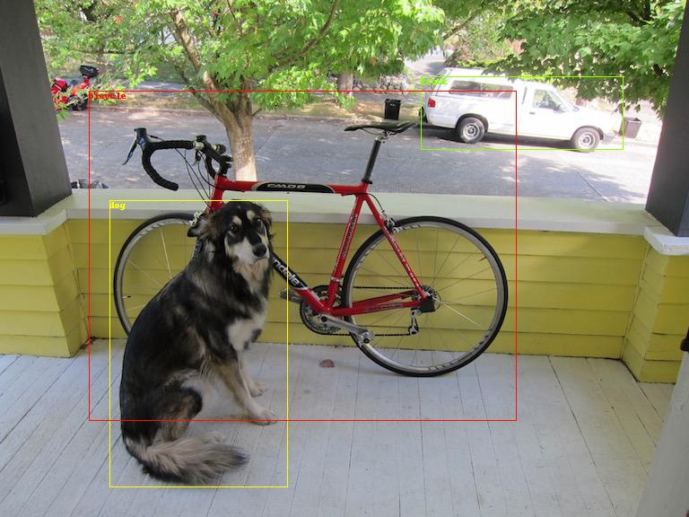

# pytorch-0.4-yolov3 : Yet Another Implimentation of Pytroch 0.41 or over and YoloV3
## This repository is created for implmentation of yolov3 with pytorch 0.4 from marvis/pytorch-yolo2. 
This repository is forked from great work pytorch-yolo2 of @github/marvis, 
but I couldn't upload or modify directly to marvis source files because many files were changed even filenames.

### Difference between this repository and marvis original version.
* some programs are re-structured for windows environments. 
(for example \_\_name\_\_ == '\_\_main\_\_' (variable in python program) is checked for multiple threads).
* load and save weights are modified to compatible to yolov2 and yolov3 versions 
(means that this repository works for yolov2 and yolov3 configuration without source modification.)
* fully support yolov3 detection and training
   * region_loss.py is renamed to region_layer.py.
   * outputs of region_layer.py and yolo_layer.py are enclosed to dictionary variables.     
* codes are modified to work on pytorch 0.4 and python3
* some codes are modified to speed up and easy readings. (I'm not sure.. T_T)
* in training mode, check nan value and use gradient clipping.

#### If you want to know the training and detect procedures, please refer to https://github.com/marvis/pytorch-yolo2 for the detail information.

### Train your own data or coco, voc data as follows:
```
python train.py -d cfg/coco.data -c cfg/yolo_v3.cfg -w yolov3.weights
```

* new weights are saved in backup directory along to epoch numbers (last 5 weights are saved, you control the number of backups in train.py)

* The above command shows the example of training process. I didn't execute the above command. But, I did successully train my own data with the pretrained yolov3.weights. 

* You __should__ notice that the anchor information is different when it used in yolov2 or yolov3 model.

* If you want to use the pretrained weight as the initial weights, add -r option in the training command

```
python train.py -d cfg/my.data -c cfg/my.cfg -w yolov3.weights -r
```

* maximum epochs option, which is automatically calculated, somestimes is too small, then you can set the max_epochs in your configuration.

#### Recorded yolov2 and yolov3 training for my own data
* When you clicked the images, videos will played on yoube.com

* yolov2 training recorded :   
[](https://www.youtube.com/watch?v=jhoaVeqtOQw)  

* yolov3 training recorded :  
[](https://www.youtube.com/watch?v=zazKAm9FClc)  

* In above recorded videos, if you use the pretrained weights as base, about less than 10 or 20 epochs, you can see the large number of proposals. However, when training is in progress, nPP decreases to zero and increases with model updates.

* The converges of yolov2 and yolov3 are different because yolov2 updates all boxes below 12800 exposures.

### Detect the objects in dog image using pretrained weights

#### yolov2 models
```
wget http://pjreddie.com/media/files/yolo.weights
python detect.py cfg/yolo.cfg yolo.weights data/dog.jpg data/coco.names 
```



Loading weights from yolo.weights... Done!  
data\dog.jpg: Predicted in 0.832918 seconds.  
3 box(es) is(are) found  
truck: 0.934710  
bicycle: 0.998012  
dog: 0.990524  
save plot results to predictions.jpg  

#### yolov3 models
```
wget https://pjreddie.com/media/files/yolov3.weights
python detect.py cfg/yolo_v3.cfg yolov3.weights data/dog.jpg data/coco.names  
```



Loading weights from yolov3.weights... Done!

data\dog.jpg: Predicted in 0.837523 seconds.  
3 box(es) is(are) found  
dog: 0.999996  
truck: 0.995232  
bicycle: 0.999973  
save plot results to predictions.jpg  

### validation and get evaluation results

```
valid.py data/yourown.data cfg/yourown.cfg yourown_weights
```

### Performances for voc datasets using yolov2 (with 100 epochs training)
- CrossEntropyLoss is used to compare classes
- Performances are varied along to the weighting factor, for example.
```
coord_scale=1, object_scale=5, class_scale=1 mAP = 73.1  
coord_scale=1, object_scale=5, class_scale=2 mAP = 72.7  
coord_scale=1, object_scale=3, class_scale=1 mAP = 73.4  
coord_scale=1, object_scale=3, class_scale=2 mAP = 72.8  
coord_scale=1, object_scale=1, class_scale=1 mAP = 50.4  
```

- After modifying anchors information at yolo-voc.cfg and applying new coord_mask
Finally, I got the 
```
anchors = 1.1468, 1.5021, 2.7780, 3.4751, 4.3845, 7.0162, 8.2523, 4.2100, 9.7340, 8.682
coord_scale=1, object_scale=3, class_scale=1 mAP = 74.4  
```

- using yolov3 with self.rescore = 1 and latest code, ___mAP = 74.9___. (with 170 epochs training)

Therefore, you may do many experiments to get the best performances.

### License

MIT License (see LICENSE file).

